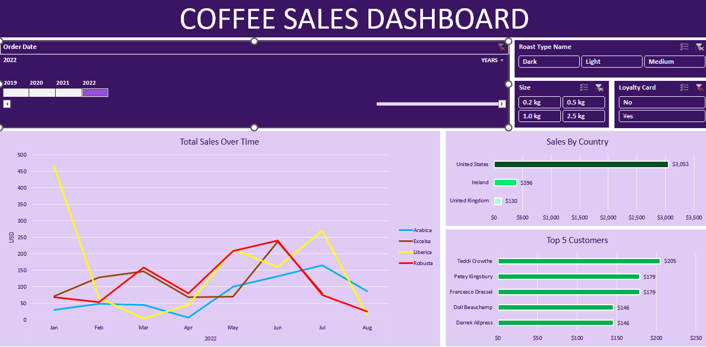

# Coffee Orders Analysis

## Project Overview

This project analyzes coffee shop order data using Microsoft Excel to understand sales performance, customer purchasing patterns, and product performance.

## Tools Used

* Microsoft Excel
* PivotTables
* Excel Charts
* Data Cleaning
* Data Analysis
* Dashboard

## Key Analysis

* Total sales and order performance
* Sales by coffee type
* Product performance
* Monthly and daily sales trends
* Customer purchasing patterns
* Key business insights through an interactive dashboard

## Project File

The Excel workbook contains the cleaned data, analysis, PivotTables, visualizations, and dashboard used for this project.

## Dashboard Preview

